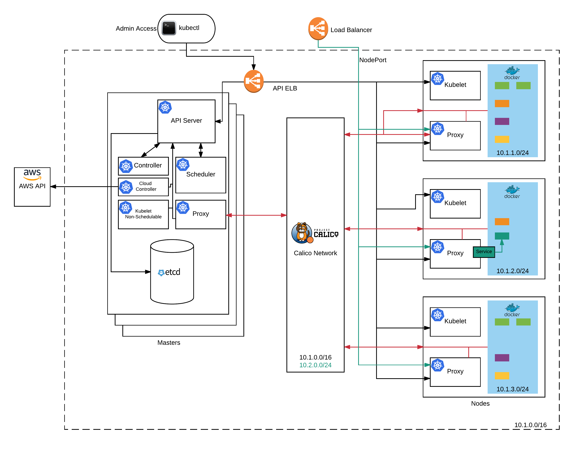
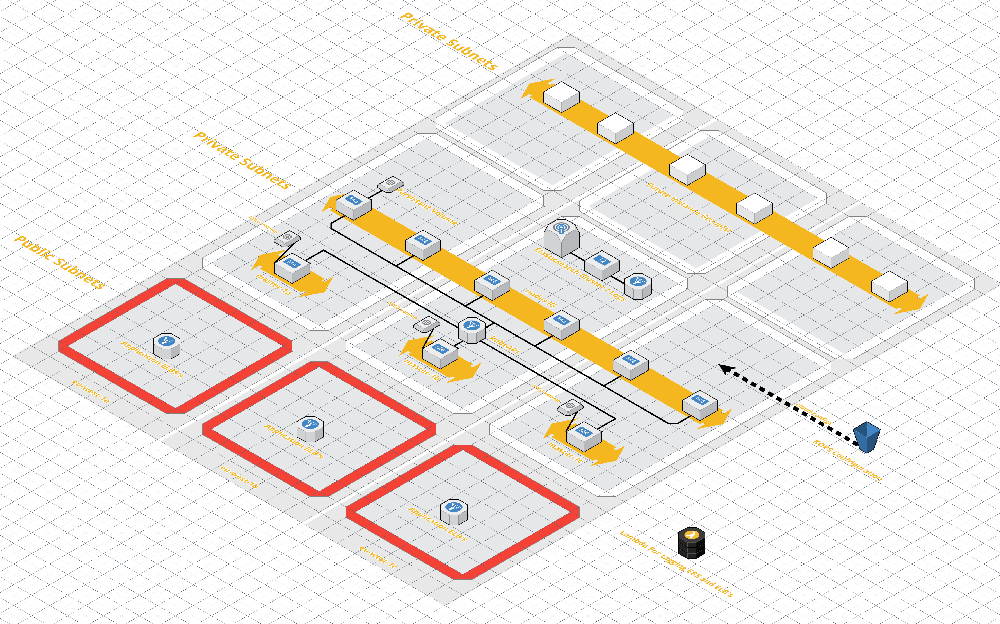

# 101 Introduction

Kubernetes 101 is designed to give you a quick insight into the components and simple operations of a k8s cluster. We'll also cover installing minikube and the kubectl cli on your local machine for testing.

## Cluster Components

### Overview

#### Masters

##### kube API Server
##### kube controller
##### kube scheduler

#### etcd

#### nodes
##### kubelet
##### kube proxy

####Networking

##### pods
##### services
##### calico

### Typical Deployment Diagram

Temrinology
- namespaces
- pods
- services
- deployments
- daemon and stateful sets

Installing k8s tools
- OSX
- Linux

Install Minikube

Basic tool usage
- create a namespace
- start a pod
- add a service / ingress
- use a deployment
- delete a pods,services,deployments
