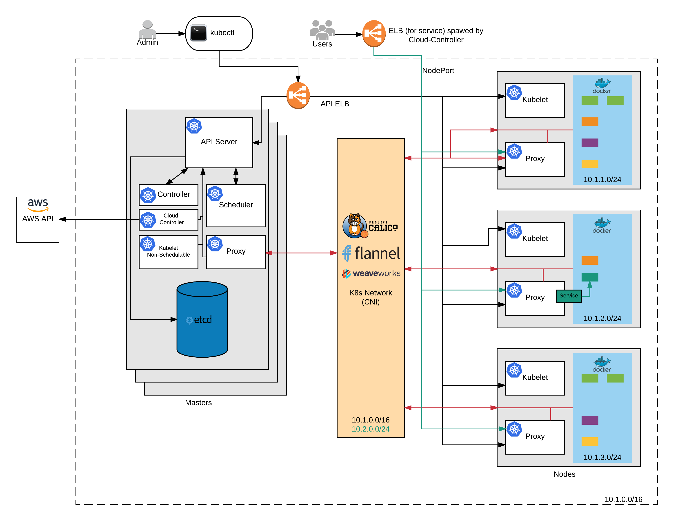
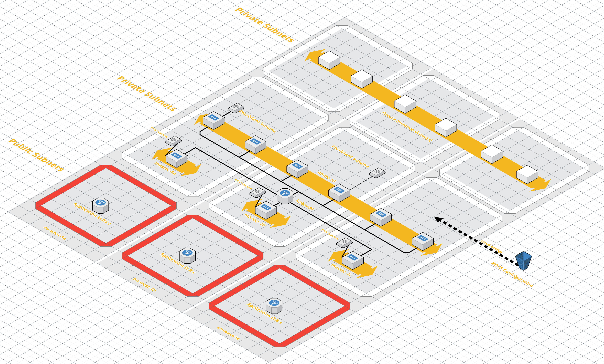

# 101 Introduction

Kubernetes 101 is designed to give you a quick insight into the components and simple operations of a k8s cluster. We'll also cover installing minikube and the kubectl cli on your local machine for testing and running the lab exercises locally to give you experiance with kubectl (the kubernetes command line interface)

## Cluster Components

### Overview



#### Masters

Masters run three (4 after 1.6 if using a cloud provider) main components. In production, you should run multiple master servers and loadbalancer across them. Its normal to run at least 3 masters, this allows the ETCD component to achieve quorum and have election to pick a master node.

##### kube-api-server

kube-apiserver exposes the Kubernetes API. It is the front-end for the Kubernetes control plane and its where the ```kubectl``` command line connects into. In a HA setup this is the service you connect the loadbalancer too.

##### kube-controller-manager

kube-controller-manager runs controllers, which are the background threads that handle routine tasks in the cluster. Logically, each controller is a separate process, but to reduce complexity, they are all compiled into a single binary and run in a single process.

These controllers include:

- Node Controller: Responsible for noticing and responding when nodes go down.
- Replication Controller: Responsible for maintaining the correct number of pods for every replication controller object in the system.
- Endpoints Controller: Populates the Endpoints object (that is, joins Services & Pods).
- Service Account & Token Controllers: Create default accounts and API access tokens for new namespaces.

##### cloud-controller-manager (new after 1.6)

cloud-controller-manager runs controllers that interact with the underlying cloud providers. The cloud-controller-manager binary is an alpha feature introduced in Kubernetes release 1.6.

cloud-controller-manager runs cloud-provider-specific controller loops only. You must disable these controller loops in the kube-controller-manager. You can disable the controller loops by setting the --cloud-provider flag to external when starting the kube-controller-manager.

cloud-controller-manager allows cloud vendors code and the Kubernetes core to evolve independent of each other. In prior releases, the core Kubernetes code was dependent upon cloud-provider-specific code for functionality. In future releases, code specific to cloud vendors should be maintained by the cloud vendor themselves, and linked to cloud-controller-manager while running Kubernetes.

The following controllers have cloud provider dependencies:

- Node Controller: For checking the cloud provider to determine if a node has been deleted in the cloud after it stops responding
- Route Controller: For setting up routes in the underlying cloud infrastructure
- Service Controller: For creating, updating and deleting cloud provider load balancers
- Volume Controller: For creating, attaching, and mounting volumes, and interacting with the cloud provider to orchestrate volumes

##### kube-scheduler

kube-scheduler watches newly created pods that have no node assigned, and selects a node for them to run on.

#### etcd

In A HA production setup you need at least 3 etcd servers. It's a key based store thats used to keep state data about whats happening in the cluster, and the k8s network.

#### nodes

##### kubelet

kubelet is the primary node agent. It watches for pods that have been assigned to its node (either by apiserver or via local configuration file) and:

- Mounts the pod’s required volumes.
- Downloads the pod’s secrets.
- Runs the pod’s containers via docker (or, experimentally, rkt).
- Periodically executes any requested container liveness probes.
- Reports the status of the pod back to the rest of the system, by creating a mirror pod if necessary.
- Reports the status of the node back to the rest of the system.

##### kube proxy

kube-proxy enables the Kubernetes service abstraction by maintaining network rules on the host and performing connection forwarding.


#### Networking

##### pods
##### services
##### calico

Calico is a new approach to virtual networking and network security for containers, VMs, and bare metal services, that provides a rich set of security enforcement capabilities running on top of a highly scalable and efficient virtual network fabric. Calico includes pre-integration with Kubernetes and Mesos (as a CNI network plugin), Docker (as a libnetwork plugin) and OpenStack (as a Neutron plugin). Calico supports a broad range of deployment options including on premise or public cloud (AWS, GCE, etc) providing the same rich set of features across all.

Calico's network policy enforcement ensures that the only packets that flow to/from a workload are the ones the developer or operater expects. This is achieved by mapping high-level developer/operator intent to fully distributed ACLs running on every host. You can think of Calico as providing every workload with a fully automated virtual firewall to protect the workload and to protect the rest of your application should that workload become compromised. Calico automatically maps any network policy concepts from the orchestration environment into Calico network policy. (For example, Calico was selected as the reference implementation of network policy for Kubernetes.) Calico network policy can also be specified using the Calico command line tools and APIs, either in place of or augmenting the policy concepts provided by the orchestration system.

Calico's highly scalable network fabric is built using the same principles as the internet - the most highly scaled network in existence. In contrast to most virtual networking solutions, Calico provides a flat IP network that can typically be run without any encapsulation (no overlays). The ability to run without an overlay provides exceptional throughput characteristics, and for large scale service operators makes diagnosing network connectivity issues a breeze. In addition Calico's network fabric also includes the ability to route packets using a stateless IP-in-IP overlay for any scenarios where an overlay network might be preferred.

Calico's network policy enforcement can also be combined with other virtual networking solutions. For example, the Canal project adds Calico policy enforcement to Flannel virtual networking. This exciting project brings rich network policy to Flannel users, and brings more network connectivity options to Calico users.

### Typical Deployment Diagram



Temrinology
- namespaces
- pods
- services
- deployments
- daemon and stateful sets

Installing k8s tools
- OSX
- Linux

Install Minikube

Basic tool usage
- create a namespace
- start a pod
- add a service / ingress
- use a deployment
- delete a pods,services,deployments
